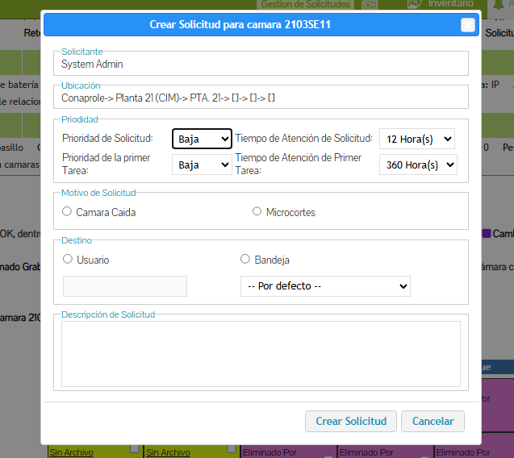

📹 Sistema de CCTV – Gestión, Monitoreo y Administración

El Sistema de CCTV es una herramienta desarrollada para gestionar cámaras de seguridad, visualizar grabaciones, administrar calendarios de eventos y generar solicitudes directamente desde las vistas del CCTV.
Proporciona una interfaz intuitiva, con funcionalidades de consulta, monitoreo y administración técnica de la infraestructura de cámaras.

🏗️ Arquitectura del Sistema

El sistema se compone de:

Planta / Instalación física
Representación visual del despliegue de cámaras y su ubicación en planta.


Servidor central de CCTV
Estructura de componentes y servicios que gestionan la captura, almacenamiento y transmisión de video.


Cámaras y conexiones
Relación entre cada cámara, el servidor y los puntos de red.


📍 Vista General de Cámaras

El sistema permite visualizar todas las cámaras disponibles, su estado y su ubicación general.

🗓️ Calendario de Grabaciones

El calendario ofrece una vista organizada por día/mes, mostrando los eventos registrados, accesos y momentos con detecciones.

● Vista mensual del calendario

● Variación con marcadores visibles

● Vista con cuadro de detalle abierto

📝 Crear Solicitud desde CCTV

Permite generar una solicitud directamente desde la vista del CCTV, por ejemplo cuando se detecta un problema, anomalía o situación a reportar.
Esto ayuda a integrar la gestión operativa con la supervisión visual del sistema.




🔧 Funcionalidades Principales

Gestión y monitoreo de cámaras.

Visualización en tiempo real y por períodos.

Exploración mediante calendario.

Consulta histórica de grabaciones.

Creación de solicitudes desde las vistas de CCTV.

Integración con estructura de red y componentes físicos.


🔍 Obtención de cámaras asociadas al servidor

Esta función obtiene todas las cámaras CCTV relacionadas a un servidor específico dentro de una planta.
Cada servidor puede tener cámaras vinculadas tanto como equipo padre como equipo hijo, por lo que la consulta utiliza un UNION para reunir ambas relaciones.
El resultado devuelve únicamente cámaras activas (no borradas), incluyendo su nombre, estado (si está en pausa) y la carpeta donde se almacenan sus grabaciones.

```php
static public function CamarasYServidoresRelacionados($serv)
{
    // 27 = id de las cámaras CCTV
    $query = "
        SELECT 
            ie.id,
            ie.nombre,
            ie.cam_en_pausa,
            ec.nombre_carpeta
        FROM equipos__relacionados er
        INNER JOIN inventario__equipos ie 
            ON er.id_equipo_b = ie.id
        INNER JOIN equipos__camaras_carpetas ec 
            ON ec.id = ie.nom_carp
        WHERE ie.id_tipo = 27 
          AND er.id_equipo_a = :serv1
          AND ie.borrado NOT IN (1,2)

        UNION

        SELECT 
            iee.id,
            iee.nombre,
            iee.cam_en_pausa,
            ecc.nombre_carpeta
        FROM equipos__relacionados err
        LEFT JOIN inventario__equipos iee 
            ON err.id_equipo_a = iee.id
        LEFT JOIN equipos__camaras_carpetas ecc
            ON ecc.id = iee.nom_carp
        WHERE iee.id_tipo = 27 
          AND err.id_equipo_b = :serv2
          AND iee.borrado NOT IN (1,2)

        ORDER BY nombre_carpeta
    ";

    try {
        $st = Db::prepQuery($query);
        $st->bindParam(':serv1', $serv);
        $st->bindParam(':serv2', $serv);

        if (!Db::execQuery($st)) {
            throw new Exception('Ocurrió un error al ejecutar la consulta de cámaras relacionadas.');
        }

        $retorno = [];

        while ($row = Db::fetchArr($st)) {
            $retorno[] = [
                'id'           => $row['id'],
                'nombre'       => $row['nombre'],
                'cam_en_pausa' => $row['cam_en_pausa'],
                'carpeta'      => $row['nombre_carpeta']
            ];
        }

        return $retorno;

    } catch (Exception $e) {
        throw new Exception('Error obteniendo cámaras del servidor: ' . $e->getMessage());
    }
}
``
